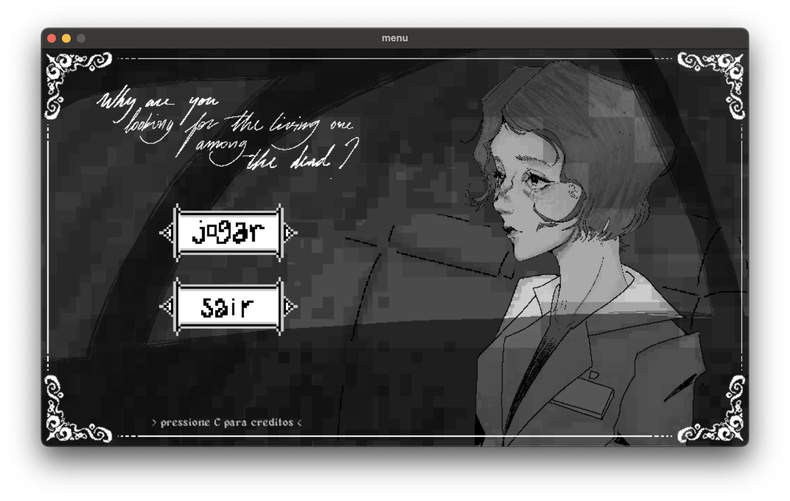
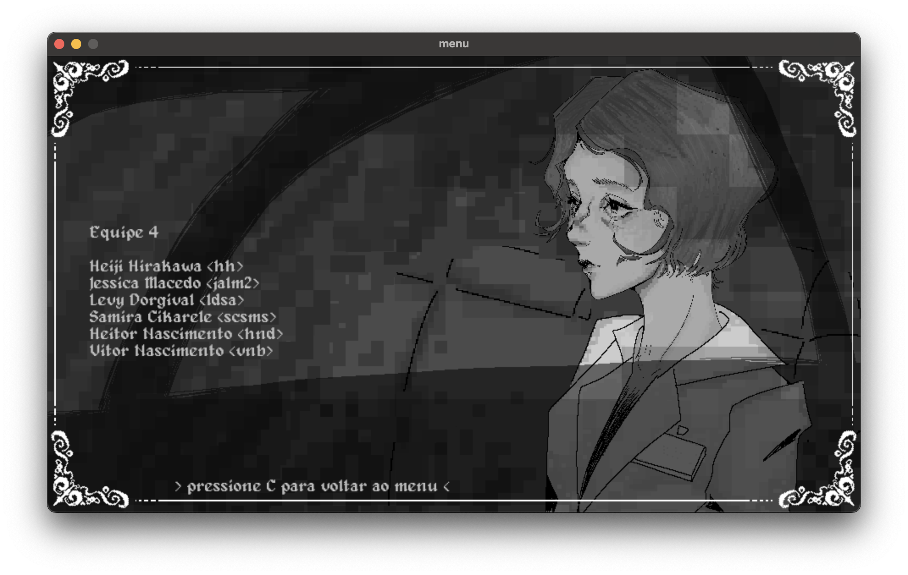
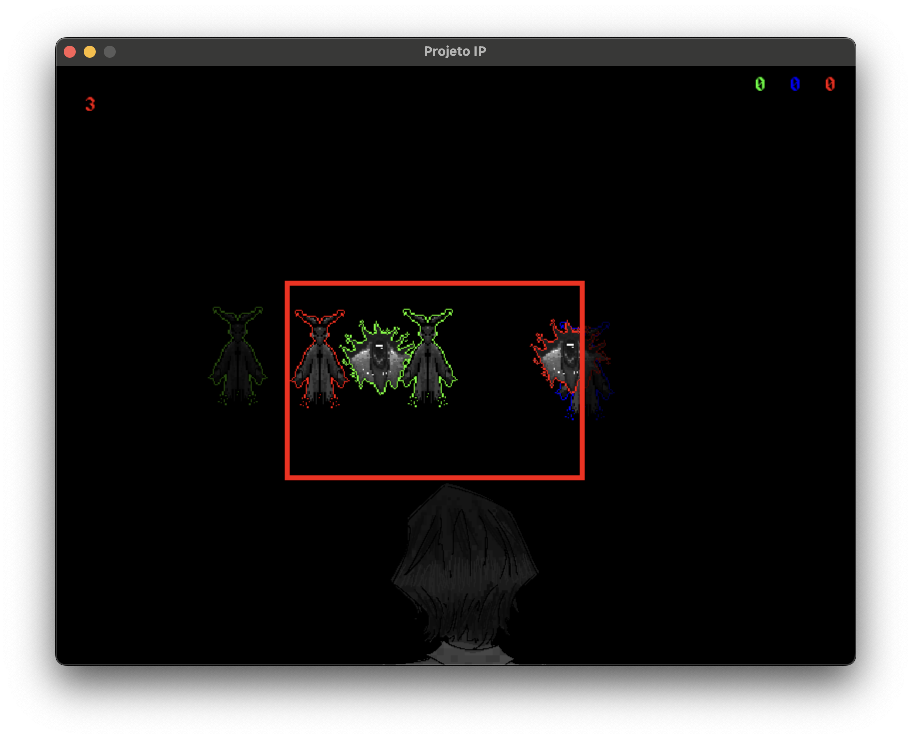
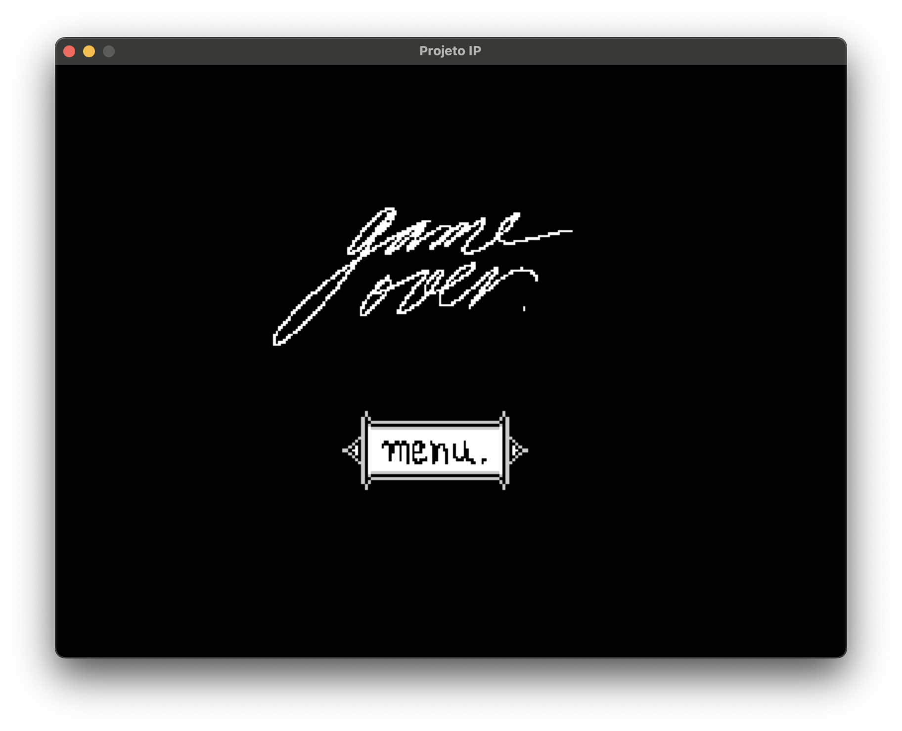

# Why Are You Looking For The Living One Among The Dead?

- Heiji Hirakawa \<hh\>,
- Jéssica Macêdo \<jalm2\>
- Levy Dorgival \<ldsa\>
- Samira Cikarele \<scsms\>
- Heitor Nascimento \<hnd\>
- Vitor Nascimento \<vnb\>

**Equipe 4**

Projeto de Introdução à Programação do curso de Engenharia da Computação 24.2 do Centro de Informática da UFPE.S

## Arquitetura do código

Optamos por centralizar tudo em um único arquivo principal (main.py) para maior eficiência e que todos os integrantes tivessem interações com o projeto completo, sem distinções (mesmo com nossas funções designadas, tivemos livre arbítrio para analisar o código de outros integrantes e sugerir adaptações). O main.py, sendo o centro de todo o código, comporta classes, funções e conceitos importantes para que o resultado final ficasse a par com as expectativas do grupo:

### Classes

- FlashEffect: Abstração que implementa o flash da câmera.
- Player: Todo código relacionado ao player. 
- Ghost: A classe mais complexa, que implementa a movimentação dos fantasmas e exibição de sprites diferentes para cada tipo de fantasmas com HP e pontuação diferentes.
- Frame: O core da gameplay do jogo, implementa o frame da câmera.
- Particula: Nesta classe foi criado o método __ init __()  para criar as partículas e definir as direções por meio de valores randômicos, também foi criado o método update() para atualizar as direções a cada frame.
- Game (principal): (inserir explicação)
- Button: Aqui, está presente o necessário para conseguir configurar um botão. Esta classe foi requerida tanto para o Menu principal quanto para a tela de Game Over. Na função __init__, definimos a base retangular do botão, enquanto em draw() temos o tracking da posição do mouse, o if onde há a interpolação entre base do botão e a posição do mouse, a detecção do clique com o botão esquerdo e, por fim, o retorno de action para a função, possibilitando posteriormente nas funções menu_principal() e gameover() definir como cada botão irá agir ao ser clicado.

### Funções
gameover(): Ao usuário perder suas três vidas, esta função é acionada e apresenta um botão de voltar para o menu principal.
menu_principal(): A primeira função a ser executada no código apresenta o layout do menu principal, juntamente com os botões.


## Divisão de trabalhos

## Bibliotecas e ferramentas

- Notion:
https://www.notion.so/Organiza-o-0ed7551e25e24895b9a5143a8418366f
- pygame:
https://www.pygame.org/docs/


## Desafios e erros

Um dos maiores desafios, sem dúvida, foi se familiarizar tanto com o Github, importante para que todos da equipe acessem e modifiquem o código, quanto com o ambiente do Pygame e implementar o conceito de Orientação a Objetos.

Quanto ao Github, certos integrantes da equipe tiveram empecilhos quanto ao sistema do Github, com os repositórios, branches e forks. Com o apoio de integrantes mais experientes e vídeos educativos, todos os integrantes conseguiram se familiarizar com a ferramenta e tirar o maior proveito possível desta, tendo assim maior controle com o repositório e mantendo o código atualizado, conciso e consistente.

Quanto ao pygame, tivemos maior dificuldade com um dos assuntos novos apresentado no trabalho: orientação a objetos. Tendo experiências prévias com python e com funções ajudou na adaptação dos integrantes ao novo assunto, e com aulas educativas e encontros com os monitores conseguimos superar mais um empecilho, tendo como resultado um trabalho que agrada a todos os participantes e uma nova área de programação explorada.

## Capturas de Tela







## Guia de contribuição

### Setup
- Instalem o [uv](https://docs.astral.sh/uv/getting-started/)
- Execute o programa com `uv run main.py`

### Convenções
- Utilizem o snake-case para nomear variáveis.
  ```py
  minha_variavel = 0 # 🟢
  minhaVariavel = 0  # ❌
  minhavariavel = 0  # ❌
  ```
- Executem `uvx ruff format .` para garantir que o código está uniforme e legível.

### Criando um Fork

- Acesse o repositório original no GitHub.
- Clique no botão Fork no canto superior direito.

### Clonando o Repositório Forkado

- Abra o terminal e clone o repositório forkado para sua máquina:
- `git clone https://github.com/seu-usuario/nome-do-repositorio.git`
- Entre no diretório do repositório:
  - `cd nome-do-repositorio`
- Adicione o repositório original como um remote upstream para poder sincronizar depois:
  - `git remote add upstream https://github.com/levydsa/projeto-ip.git`
- Verifique os remotes configurados:
  - `git remote -v`

### Criando e Trocando de Branch

- Sempre comece na branch main ou master e atualize-a antes de criar uma nova branch:
  - `git checkout main`
  - `git pull upstream main`
- Agora, crie e mude para uma nova branch para trabalhar na sua feature ou correção:
  - `git checkout -b minha-nova-branch`

### Fazendo Alterações e Commitando

- Faça suas alterações no código e adicione os arquivos modificados:
  - `git add .`
- Crie um commit com uma mensagem descritiva:
  - `git commit -m "Adiciona nova funcionalidade X"`

### Enviando as Mudanças para o GitHub

- Envie suas mudanças para o repositório forkado:
  - `git push origin minha-nova-branch`

### Abrindo um Pull Request (PR)

- Vá para seu repositório no GitHub.
- Clique no botão Compare & pull request que aparece depois do push.
- Verifique as mudanças e preencha a descrição do PR.
- Clique em Create pull request para enviar sua contribuição.

### Atualizando sua Branch main e Criando uma Nova Branch

Depois que seu PR for revisado e aprovado, atualize sua branch main e crie uma nova branch para um novo trabalho.

- Volte para a main:
  - `git checkout main`
- Pegue as atualizações do repositório original:
  - `git pull upstream main`
- Envie essas atualizações para seu repositório forkado:
  - `git push origin main`
- Criando uma nova branch para o próximo trabalho
  - `git checkout -b outra-nova-branch`

